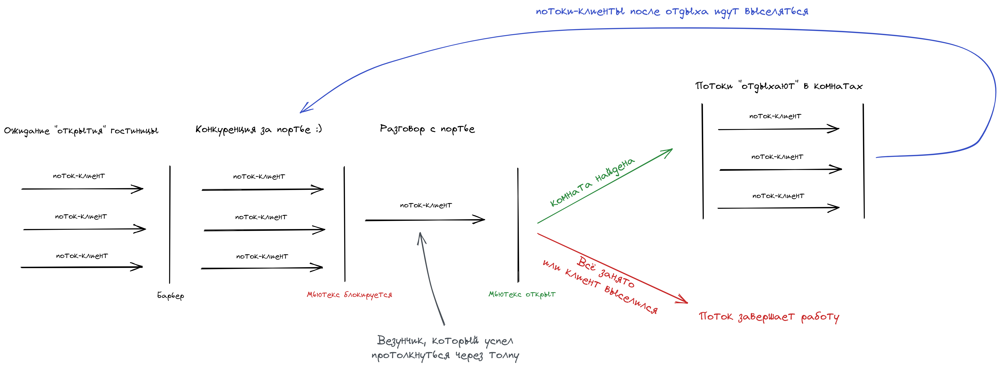
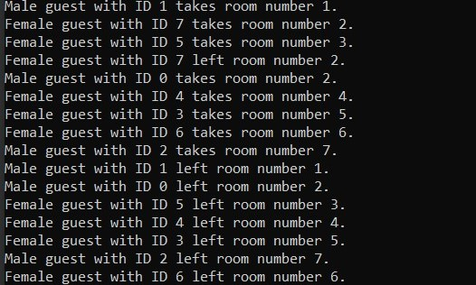
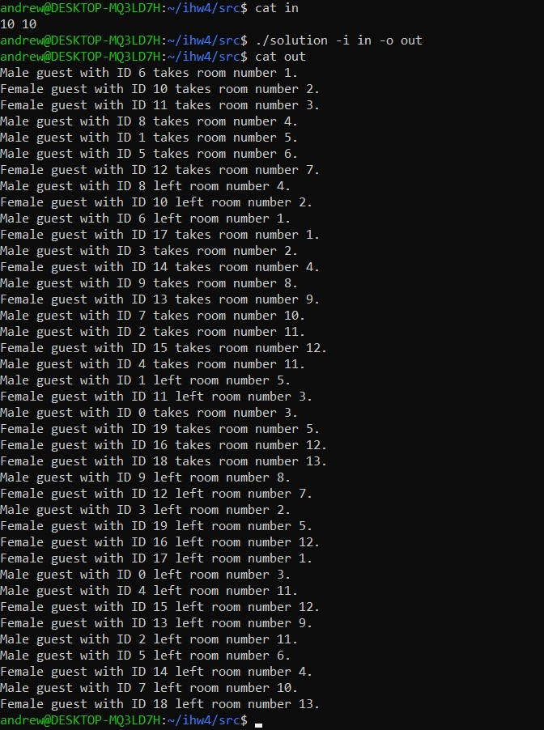
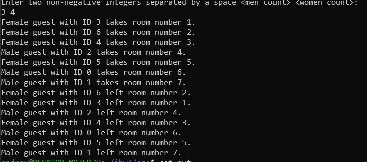
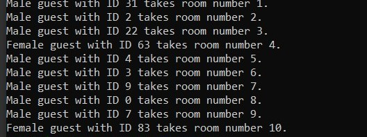
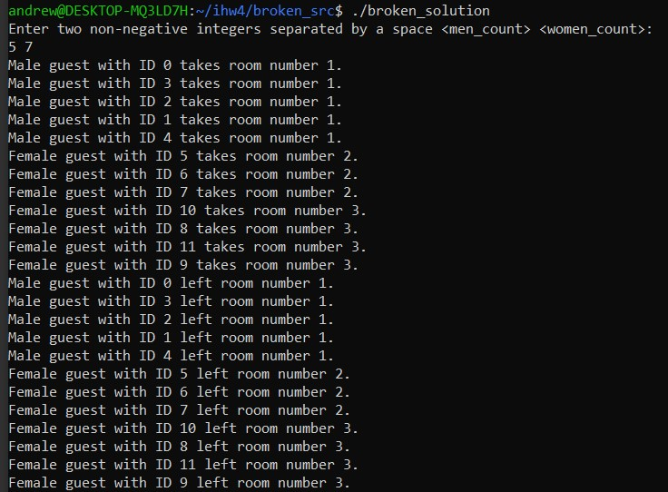

# Распределенные вычисления

Лабораторная работа № 21. Семафоры: защита критических секций, условная синхронизация

#### Студент: Дютин Тимур Олегович
#### Группа: ПИ-2-21
#### Вариант: 4

## Содержание
- [Условие к варианту](#условие-к-варианту)
- [Формат работы программы](#формат-работы-программы)
- [Критерии на 4 балла](#критерии-на-4-балла)
  - [Модель вычислений](#модель-вычислений)
  - [Описание входных данных](#описание-входных-данных)
  - [Консольное приложение](#консольное-приложение)
  - [Ввод и вывод данных](#ввод-и-вывод-данных)
- [Критерии на 5 баллов](#критерии-на-5-баллов)
  - [Комментарии к исходному коду программы](#комментарии-к-исходному-коду-программы)
  - [Сценарий поведения сущностей](#сценарий-поведения-сущностей)
- [Критерии на 6 баллов](#критерии-на-6-баллов)
  - [Описание обощенного алгоритма](#описание-обощенного-алгоритма)
  - [Ввод из командной строки](#ввод-из-командной-строки)
  - [Файловый ввод и вывод](#файловый-ввод-и-вывод)
- [Критерии на 7 баллов](#критерии-на-7-баллов)
  - [Файловый ввод и вывод](#файловый-ввод-и-вывод)
  - [Примеры входных и выходных файлов](#примеры-входных-и-выходных-файлов-1)
  - [Вывод в консоль и в файл](#вывод-в-консоль-и-в-файл)
- [Критерии на 8 баллов](#критерии-на-8-баллов)
  - [Генератор случайных данных](#генератор-случайных-данных)
  - [Примеры входных и выходных файлов](#примеры-входных-и-выходных-файлов-2)
- [Критерии на 9 баллов](#критерии-на-9-баллов)
  - [Тестирование без синхропримитивов](#тестирование-без-синхропримитивов)
  - [Почему всё пошло не так](#почему-всё-пошло-не-так)

## Условие к варианту
>Задача о гостинице - 3 (дамы и джентльмены).
> В гостинице 10 номеров рассчитаны на одного человека и 15 номеров рассчитаны на двух человек.
> В гостиницу случайно приходят клиенты дамы и клиенты джентльмены,
и конечно они могут провести ночь в номере только с представителем своего
пола. Если для клиента не находится подходящего номера, он уходит искать
ночлег в другое место. Клиенты порождаются динамически и уничтожаются
при освобождении номера или уходе из гостиницы при невозможности поселиться.
> Создать многопоточное приложение, моделирующее работу гостиницы

При решении задачи комнаты на 1 человека нумеровались числами от 1 до 10, а на 2 человека &mdash; от 11 до 25.

## Формат работы программы
```
./solution [-i INPUT_FILE] [-o OUTPUT_FILE] [-s SEED] [-m MALE_COUNT] [-f FEMALE_COUNT] [-r] [-d]
```
`-i INPUT_FILE` указывает на то, что данные нужно читать с файла. В качестве аргумента требуется указать путь ко входному файлу.   
`-o OUTPUT_FILE` указывает на то, что данные нужно выводить в файл. В качестве аргумента опция требуется указать путь к выходному файлу.   
`-m MALE_COUNT` задает количество клиентов мужского пола.  
`-f FEMALE_COUNT` задает количество клиентов женского пола.  
`-r` указывает на то, что программа сама должна сгенерировать входные данные.  
`-s SEED` семя рандома. В качестве аргумента нужно указать целое число от 1 до 1'000'000.  
`-d` указывает на то, что выводить данные нужно не только в файл, но и в консоль.


## Критерии на 4 балла
### Модель вычислений 
При разработке многопоточной программы использовалась модель **итеративного параллелизма**

Каждый из потоков решает одну и ту же задачу &mdash; ищет свободную комнату в гостинице. Поиск такой комнаты происходит обходом всех номеров в цикле. Взаимодействие потоков происходит через общий ресурс &mdash; массив всех комнат гостиницы. 

### Описание входных данных

На вход программе подается два целых неотрицательных числа &mdash; количество клиентов мужского пола и количество клиентов женского пола, причем суммарное количество клиентов не превышает 150.

### Консольное приложение
Реализовано консольное приложение на C++, исходные коды которого расположены в следующей директории: [src/](src/)

Скомпилировать программу можно следующей командой:
```console
g++ -std=c++17 main.cpp gender.h person.h room.h -lpthread -o solution
```

### Ввод и вывод данных
Реализован консольный ввод и вывод данных.
<p align="center">

</p>
<p align="center">
<em>Пример консольного ввода и вывода.</em>
</p>

## Критерии на 5 баллов
### Комментарии к исходному коду программы
Исходный код прокомментирован: [src/](src/)
### Сценарий поведения сущностей
Сначала все клиенты собираются у дверей гостиницы и ожидают её открытия. После того как гостиница открывается, все клиенты в спешке несутся к портье, чтобы заселиться в первый свободный номер. Портье же, человек аккуратный и неторопливый, поэтому работает только с одним клиентом, из-за чего ажиотаж среди возможных постояльцев настолько велик, что клиенты не выстраиваются в очередь, а конкурируют за возможность как можно раньше попасть к портье.  

Попав в номер, клиент некоторое время отдыхает, а затем снова возвращается к портье, чтобы выселиться: внести плату за проживание и вернуть ключи от комнаты.
## Критерии на 6 баллов
### Описание обощенного алгоритма
<p align="center">

</p>

В программном коде клиенты проецируются на потоки. Чтобы ситуация была более равноправной, мы дожидаемся, пока все потоки запустятся, именно потому мы ставим барьер.  

 Как только все потоки запустились (== гостиница открылась) начинается конкуренция среди потоков-клиентов: первый, кто войдет в критическую секцию и закроет мьютекс (== обратиться к портье), сможет первым найти свободные комнаты и занять одну из них.   

 После этого поток-клиент открывает мьютекс и либо отправляется в свою комнату спать некоторое время, либо завершает свою работу, если он не нашёл подходящий номер. Остальные потоки по-прежнему конкурируют за вход в критическую секцию.

 Если поток-клиент всё-таки занял комнату и проспал заданное время, он снова переходит к конкуренции за вход в критическую секцию, чтобы выселиться из номера.

 После того как поток выселился из комнаты, он завершает свою работу.

 Программа (== гостиница) работатет до тех пор, пока все потоки либо не уйдут без комнаты, либо не выселятся из занятой комнаты.

### Ввод из командной строки
Данные вводятся при помощи соответствующих опций `-m` и `-f`, описанных в [формате работы программы](#формат-работы-программы).
<p align="center">

</p>
<p align="center">
<em>Демонстрация ввода из командной строки.</em>
</p>

## Критерии на 7 баллов
### Файловый ввод и вывод
<p align="center">

</p>
<p align="center">
<em>Демонстрация файлового ввода/вывода.</em>
</p>

### Примеры входных и выходных файлов 1
Пример входных и выходных данных располагаются в директории [tests/](tests/)
Входные файлы имеют формат `<filname>.in`, а соответствующие выходные &mdash; `<filename>.out`
### Вывод в консоль и в файл
Программа может выводить одновременно данные и в консоль и в файл. Для этого нужно задать соответствующие опции, описанные в [формате работы программы](#формат-работы-программы).
<p align="center">

</p>
<p align="center">
<em>Демонстрация вывода в консоль и файл.</em>
</p>


## Критерии на 8 баллов
### Генератор случайных данных
Чтобы работать с генератором случайных данных, нужно укзать опции `-r` и `-s SEED` (при необходимости).  
<p align="center">

</p>
<p align="center">
<em>Демонстрация генерации случайных входных данных.</em>
</p>

### Примеры входных и выходных файлов 2
Примеры входных и выходных данных в директории [tests/](tests/) дополнены двумя входными и выходными файлами `5.in`, `6.in`, `5.out`, `6.out`. Входные файлы были сгенерированы случайно. 

## Критерии на 9 баллов
Исходные коды программы с отключенными синхропримитивами находятся в директории [broken_src/](broken_src/)

### Тестирование без синхропримитивов
Попробуем запустить программу на некоторых данных:
<p align="center">

</p>
<p align="center">
<em>Упс...</em>
</p>

В комнату на 1 человека подселилось сразу 5! Программа точно работает некорректно без синхропримитивов.

### Почему всё пошло не так
К некорректному поведению приводит то, что, пока один поток заселяется в первую найденную комнату, другие потоки уже успели найти эту комнату в качестве свободной и тоже собираются подселиться в неё. То есть потоки пытаются одновременно изменить разделяемый ресурс.
